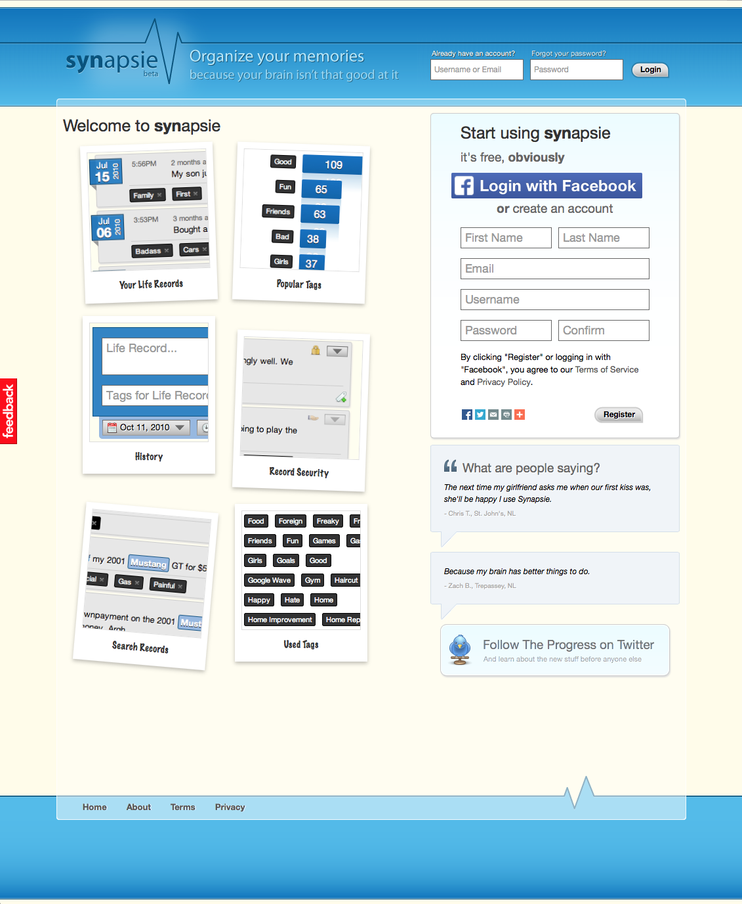

# Synapsie

This is the original source code for synapsie.com (no longer online). It was a web service I created for recording life memories. Powered by [Python](https://www.python.org), [Django](https://www.djangoproject.com), [Apache](https://httpd.apache.org) and [jQuery](http://jquery.com).

I originally worked on this back in early 2010 as a way to learn Python and Django. And I wanted to grow my existing knowledge of web development and build and ship a project from start to finish.

Sadly, I had to shut the service down as I simply didn't have the time to maintain it. I've decided to publish the source code here for anyone who might be interested in seeing it and as a means to archiving a small piece of my programming history.

